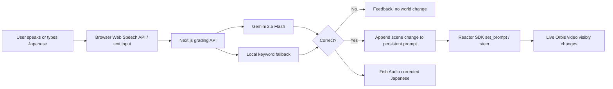

# Kotodama: Visko Orbis Challenge Execution Plan

## 1. Objective

Ship **Kotodama (言霊)** as a polished, publicly accessible Japanese-learning game in which the learner's Japanese speech directly and repeatedly changes a live Orbis-generated world.

The winning message is:

> **Speak Japanese. Watch your words become reality.**

The project must prove that Orbis is not decorative. Real-time steering is the core learning mechanic, because every unpredictable learner answer changes the same living video world within seconds.

## 2. Deadline and Working Window

- Official deadline: **September 24, 2026 at 12:00 PM Pacific Time**.
- Expected India time: **September 25, 2026 at 12:30 AM IST** while Pacific daylight time is active.
- Treat **September 24 at 8:00 PM IST** as the internal deadline.
- Reserve the final 4.5 hours for upload failures, deployment issues, and submission checks.

## 3. Judging Strategy

### 3.1 Real-time interaction, highest weight

What judges must see:

1. A live world is already running.
2. The learner speaks or types an unpredictable Japanese sentence.
3. The answer is interpreted.
4. The existing world visibly changes without restarting or generating a separate canned clip.
5. This happens several times in sequence, preserving the evolving scene.
6. An incorrect answer does not change the world.

Presentation rule: show this full loop in the first 30 seconds of the demo video.

### 3.2 Creativity

Position Kotodama as **visible comprehensible output**, not another chatbot or video generator. Language learners normally receive text corrections. Kotodama makes meaning visible inside a persistent world, turning language into an action.

### 3.3 Functionality

One flawless world is more valuable than three unreliable worlds. The Park scenario should be the primary demo path. Classroom and Night City are supporting proof of extensibility.

## 4. Product Scope

### Must ship

- Public landing/game URL.
- Stable Orbis session connection.
- One fully reliable four-step scenario.
- Correct-answer steering.
- Incorrect-answer rejection with no scene change.
- Text input and microphone input.
- Clear loading, connection, success, and error states.
- Gemini grading with local fallback.
- Spoken corrected Japanese, with graceful fallback if TTS fails.
- Completion screen and replay flow.
- Mobile-readable landing page, but optimize the actual experience for desktop Chrome.
- Public source repository if challenge rules require it.
- Demo video.
- Submission text, technology list, and working links.

### Nice to have only after the core is proven

- All three worlds polished.
- Shareable completion card.
- Score or accuracy summary.
- Before/after scene timeline.
- Extra visual effects.
- User accounts, database, leaderboard, or payments.

Do not add authentication, a database, multiplayer, or a large new feature before submission.

## 5. Technical Architecture



### Stack explanation

- **Next.js 16 + React 19 + TypeScript**: full-stack web application and UI.
- **Visko Orbis through Reactor SDK**: persistent, steerable live video world.
- **Gemini 2.5 Flash**: meaning-based Japanese answer evaluation and correction.
- **Local keyword grader**: resilient fallback if Gemini is unavailable.
- **Fish Audio**: natural spoken Japanese correction.
- **Web Speech API**: microphone-based Japanese input in supported browsers.
- **Vercel**: recommended deployment for the Next.js application.

## 6. Environment and Deployment

Required server-side environment variables:

```text
REACTOR_API_KEY=...
GEMINI_API_KEY=...
FISH_API_KEY=...
```

Rules:

- Never expose keys in client code, screenshots, video, Git history, or the public repository.
- Keep `.env.local` ignored.
- Add all three variables to the production hosting environment.
- Redeploy after changing production variables.
- Apply platform spending limits where available.
- Rotate any key immediately if it appears in a recording or commit.

Recommended deployment sequence:

1. Confirm a clean local production build.
2. Push the latest code to GitHub.
3. Import the repository into Vercel.
4. Configure environment variables.
5. Deploy to production.
6. Test from a separate browser/incognito window.
7. Test on a different network if possible.
8. Assign a memorable project domain if quickly available, otherwise use the stable Vercel URL.

## 7. API Credit Plan

The $250 Reactor credit is a prototype budget, not a target to spend.

- Use short, deliberate test sessions.
- Disconnect immediately after each test.
- Avoid leaving sessions running in background tabs.
- Use the Park scenario for repeated tests.
- Record the final demo in one or two prepared takes.
- Check the Reactor dashboard after initial tests and estimate cost per complete run.
- Reserve at least 40% of credits for final recording, judge traffic, and unexpected retries.
- If public traffic could consume credits, add a simple session limit, waitlist, or demo-hours notice after recording the working public experience.

## 8. Reliability Checklist

Test each item and record the result:

- [ ] Production build passes.
- [ ] Typecheck passes.
- [ ] Public page loads without authentication.
- [ ] Reactor token endpoint works in production.
- [ ] Orbis connects from a fresh browser session.
- [ ] Initial Park world begins playing.
- [ ] First correct typed answer changes the same live scene.
- [ ] Four correct answers produce four sequential changes.
- [ ] Incorrect answer gives feedback and does not steer the world.
- [ ] Minor grammar error is accepted when meaning is correct.
- [ ] Local grader works when Gemini is unavailable.
- [ ] Microphone permission denial does not break text entry.
- [ ] Speech recognition captures Japanese in Chrome.
- [ ] TTS success plays audio.
- [ ] TTS failure does not stop game progress.
- [ ] Leaving a world disconnects the Reactor session.
- [ ] Refreshing or closing the tab cleans up the session.
- [ ] Completion screen can return to world selection.
- [ ] Error messages tell the user what to do next.
- [ ] No API key appears in browser source, network responses, repository, or video.
- [ ] Public URL works in incognito mode.

## 9. Product Polish Priorities

### Priority 0: live loop correctness

- Validate the actual Orbis connection now that the API key is available.
- Measure time from submit to visible scene change.
- Confirm prompt updates preserve prior additions.
- Ensure the next objective is not shown before steering begins.
- Ensure double submission cannot trigger duplicate changes.
- Ensure a disconnect can be recovered without refreshing.

### Priority 1: judge comprehension

The page should explain the product in under ten seconds:

- Headline: **Speak Japanese. Watch your words become reality.**
- Subheadline: **A live language-learning world powered by Visko Orbis.**
- Primary CTA: **Enter a world**.
- Small instruction: **Best experienced in desktop Chrome with sound on.**
- Add a one-line Orbis explanation near the game: **Every correct sentence steers the same live world in real time.**

### Priority 2: visible proof

- Display a compact event indicator such as “Japanese understood → steering live world”.
- Keep the current objective, learner input, feedback, and video visible together.
- On completion, show accuracy and the sequence of changes made.
- Do not clutter the video with developer controls.

### Priority 3: resilience

- Friendly failure message for Reactor connection problems.
- Retry connection button.
- Timeouts for grading and TTS.
- Continue without audio when Fish Audio fails.
- Avoid uncaught promise errors.

## 10. Time-Boxed Schedule

## September 22: prove the live core

### Block 1, immediately: 60 to 90 minutes

- Add the Reactor key locally without displaying or committing it.
- Run typecheck and production build.
- Start the app and connect to the Park.
- Complete all four Park objectives using typed input.
- Record defects, latency, visual continuity, and credit consumption.

Exit condition: at least one successful correct-answer-to-visible-change loop.

### Block 2: 2 to 4 hours

- Fix live connection, token, WebRTC, prompt steering, and cleanup problems.
- Add useful user-facing error and retry states.
- Repeat the Park path until it succeeds three times consecutively.

Exit condition: three clean Park runs without code changes between runs.

### Block 3: 2 hours

- Test incorrect answers, minor grammar errors, microphone input, Gemini fallback, and TTS failure.
- Make text input the guaranteed fallback.
- Check Classroom and Night City once each. Disable a broken scenario rather than shipping it unreliably.

### Block 4: 2 hours

- Deploy to Vercel.
- Configure production secrets.
- Run the complete Park path in production and incognito.
- Save the final stable URL.

End-of-day deliverable: a public link with a reliable live loop.

## September 23: polish and produce submission assets

### Morning

- Improve hero copy, instructions, loading states, and completion screen.
- Add obvious real-time steering status.
- Remove unused starter/demo UI from the user path.
- Check desktop layouts at common laptop resolutions.

### Afternoon

- Run the complete acceptance checklist.
- Ask one person unfamiliar with the project to use it without guidance.
- Fix only blockers and confusing moments.
- Freeze features after this test.

### Evening

- Prepare a clean browser profile and quiet recording environment.
- Rehearse the demo script twice.
- Record screen and voice, ideally in 1080p.
- Edit a concise 90 to 150 second video.
- Upload unlisted to YouTube unless the challenge requires another host.
- Verify video audio, captions, visibility, and link permissions.

End-of-day deliverable: final public app, final video, draft submission.

## September 24: stabilize and submit early

### Morning IST

- Test production from a fresh browser and another device/network.
- Confirm repository and README are presentable.
- Check remaining Reactor credit.
- Capture backup screenshots and a backup screen recording.
- Do not make architectural changes.

### Afternoon IST

- Complete the official submission form.
- Verify every link after pasting it.
- Save screenshots or confirmation email proving submission.

### Internal cutoff: 8:00 PM IST

Submit by this time. Use the remaining time only for correcting submission mistakes or restoring a broken deployment.

## 11. Demo Video Plan

Target length: **90 to 150 seconds**. Lead with the experience, not your biography or a long architecture explanation.

### Shot-by-shot storyboard

**0:00-0:08, hook**

Show the live Park and say:

> “What if practicing Japanese could literally change the world in front of you?”

**0:08-0:28, core loop**

- Show objective: tell the world there is a cat in the park.
- Speak or type the Japanese answer.
- Show it being understood.
- Keep the video focused on the cat appearing in the same live world.

Say:

> “This is Kotodama. When my Japanese is understood, Visko Orbis steers the live world within seconds.”

**0:28-0:42, failure proves the mechanic**

- Enter an intentionally wrong answer.
- Show corrective feedback and no world change.

Say:

> “If the meaning is wrong, the world does not change. The video is the learning feedback.”

**0:42-1:05, persistent sequential steering**

- Complete two more objectives quickly.
- Show the dog, weather, or rain being added while earlier elements remain.

Say:

> “Each answer updates the same persistent scene, so the learner builds a world through a real conversation rather than generating disconnected clips.”

**1:05-1:30, technology**

Show a simple architecture graphic or briefly show the interface while speaking:

> “The app uses Next.js and TypeScript. Gemini evaluates meaning and returns a natural correction, Fish Audio speaks it back, and the Reactor SDK steers Orbis in real time. A local grader keeps the core loop usable if Gemini is unavailable.”

**1:30-1:45, why Orbis is essential**

> “This experience cannot be pre-rendered because the learner's next sentence is unpredictable. Live, steerable video is not an effect here. It is the core teaching mechanic.”

**1:45-1:55, close**

> “Kotodama means word spirit: the belief that spoken words shape reality. Here, they actually do.”

Show the name, public URL, and GitHub URL.

### Recording rules

- Use desktop Chrome.
- Hide bookmarks, notifications, secrets, console, and unrelated tabs.
- Record at 1080p or higher.
- Make the Japanese input and resulting scene change readable.
- Use cursor movement sparingly.
- Cut waiting time, but do not fake the sequence or imply pre-recorded output is live.
- Add captions.
- Keep music low or omit it.
- Prepare a backup take in case the live service becomes unavailable.

## 12. Landing Page Structure

1. Hero with the one-sentence value proposition.
2. Immediate “Enter a world” CTA.
3. Three-step explanation:
   - Receive a Japanese objective.
   - Speak or type your answer.
   - Watch the live world respond.
4. Embedded or linked demo video.
5. “Why live video?” section explaining why pre-rendering cannot work.
6. Technology section.
7. Creator section with your name and role.
8. GitHub and demo links.

The playable experience should remain the primary page focus. Do not spend a full day building a separate marketing site.

## 13. README Structure

- Project title and hook.
- Demo URL and video URL at the top.
- One animated GIF or screenshot.
- Why real-time Orbis is load-bearing.
- Feature list.
- Architecture diagram.
- Tech stack.
- Local setup with `.env.example`, using placeholders only.
- Known browser requirements.
- Credits and acknowledgements.
- Creator/team details.

## 14. Suggested Submission Copy

### Short description

**Kotodama is an immersive Japanese-learning game where correctly spoken or typed Japanese changes a persistent AI-generated world in real time. Gemini checks whether the learner's meaning is understood, Fish Audio speaks a natural correction, and Visko Orbis immediately steers the living scene. Wrong answers leave the world unchanged, making live video itself the feedback mechanism.**

### Why Orbis is essential

**The learner's input is unpredictable and arrives turn by turn. Kotodama must preserve and steer the same running world after each answer, making real-time generation essential rather than decorative. Pre-rendered video or one-shot generation could not support the core learning loop.**

### Creativity statement

**Most language apps respond with text, scores, or canned animation. Kotodama turns comprehensible output into a visible consequence: learners practice a language by using it to shape reality.**

## 15. Final Submission Package

Prepare one document containing:

- Project name: Kotodama (言霊).
- Tagline: Speak Japanese. Watch your words become reality.
- Public application URL.
- Public or judge-accessible repository URL.
- Demo video URL.
- Short description.
- Why Orbis is essential.
- Tech stack.
- Your name, email, and team details.
- Browser recommendation.
- Known limitations, only if the form asks.

## 16. Stop Conditions and Tradeoffs

- If only one scenario works reliably, submit one excellent scenario.
- If speech recognition is unreliable, demonstrate typed input and describe microphone input as supported in Chrome.
- If TTS is unreliable, make it optional and never block progress on it.
- If Gemini fails, use the local grader and preserve the Orbis loop.
- If production deployment fails, prioritize fixing one stable public deployment over visual improvements.
- Do not rebuild the starter's proven WebRTC/session code without evidence that it is the cause.
- Stop adding features once the core path works repeatedly in production.

## 17. Immediate Next Actions

1. Locate the official submission page and confirm required fields, video limit, repository visibility, and team registration today.
2. Put the Reactor API key into local `.env.local` without sharing or committing it.
3. Run one live Park session immediately.
4. Fix the live path until three consecutive complete runs pass.
5. Deploy and test production before doing any more visual polish.
