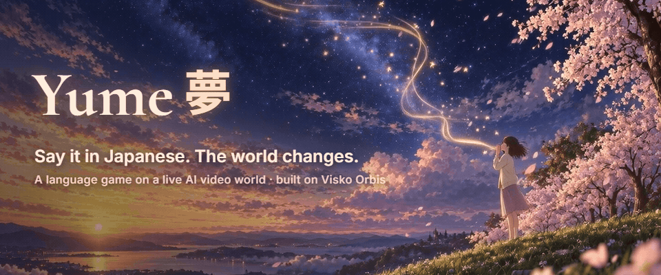
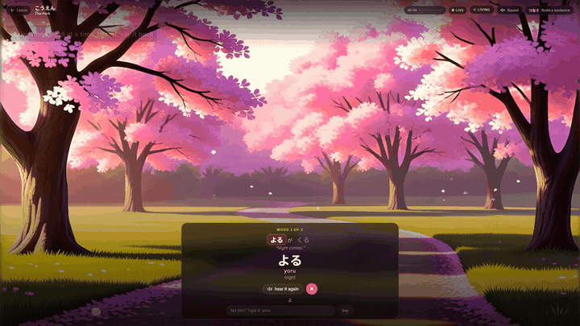
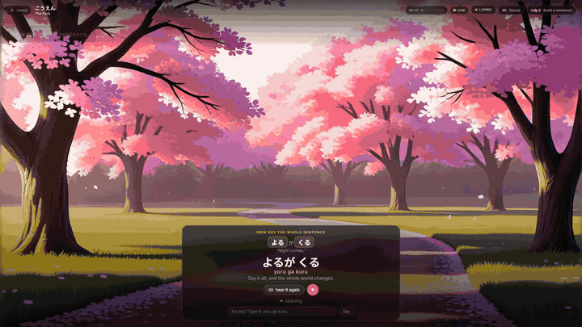
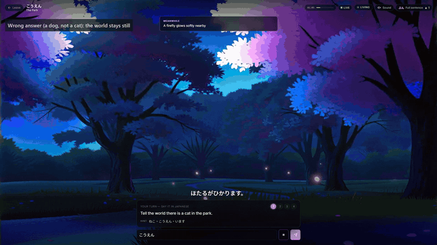
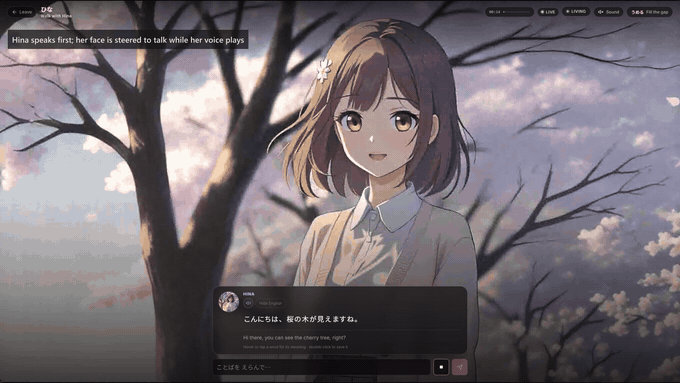
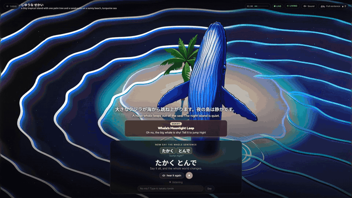
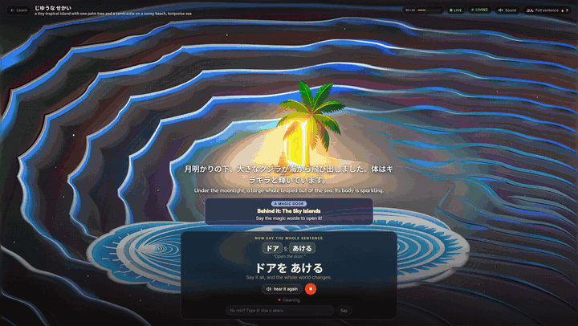
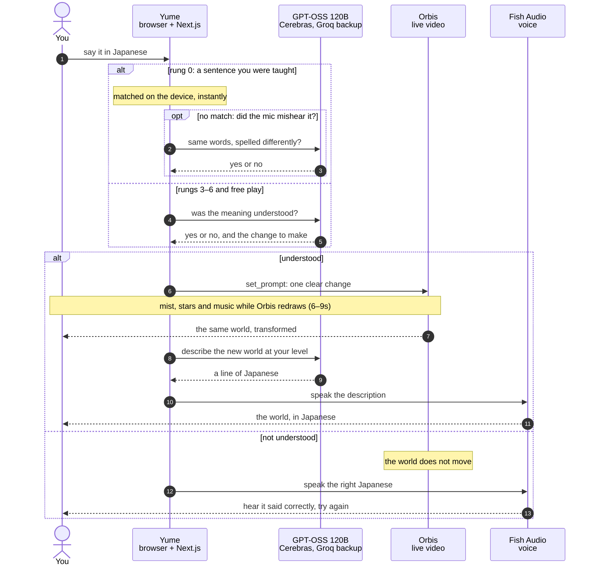

<p align="center">
  
</p>

<p align="center">
  <b>Say it in Japanese, and a live AI video world changes around you.</b><br>
  <sub>A language-learning game built on <a href="https://www.reactor.inc/models/visko-orbis-stable">Visko Orbis</a>, a real-time, steerable video model · made for the <a href="https://www.visko.ai/challenge/orbis-september-2026">Visko Orbis Online Challenge</a></sub>
</p>

<p align="center">
  <a href="#see-it-live">See it</a> ·
  <a href="#how-a-turn-works">How a turn works</a> ·
  <a href="#why-it-has-to-be-live-video">Why live video</a> ·
  <a href="#what-i-learned-about-orbis">What I learned about Orbis</a> ·
  <a href="#the-stack">Stack</a> ·
  <a href="#run-it-yourself">Run it</a>
</p>

---

**Yume** (夢, *dream*) drops you into a world that is being generated live, frame by frame, and keeps moving whether you speak or not. The only way to change it is to say what you want **in Japanese**. If you are understood, that same running world transforms in front of you. If you are not, nothing happens: no buzzer, no red cross, just a world that did not move.

There is an old Japanese belief, *kotodama* (言霊), that words have a spirit, and that saying something can make it real. Yume is the place where that is literally true.

It starts from **zero Japanese**. A first-time player is taught one short sentence a word at a time, says it back, and watches the whole world turn to night.

And it works **both ways**. Pick a world, and Yume asks what you want to learn: Japanese (with help in English), or English (with help in Japanese). A child in Tokyo can make the same dream answer to *"The moon rises"* that a child in London makes answer to *つきが のぼる*.

## See it live

<table>
  <tr>
    <td width="50%"></td>
    <td width="50%"></td>
  </tr>
  <tr>
    <td><b>Learn a sentence, one word at a time.</b> Each word is spoken, glossed, and lights up when you say it back.</td>
    <td><b>Say it whole, and your words cast a spell.</b> よるが くる, "night comes", and the live park turns to a starry night.</td>
  </tr>
  <tr>
    <td></td>
    <td></td>
  </tr>
  <tr>
    <td><b>A wrong answer changes nothing.</b> The right one steers the world, and the magic plays while Orbis redraws it.</td>
    <td><b>Walk with Hina.</b> She answers in Japanese (with English at your level), and what she says changes the world too.</td>
  </tr>
  <tr>
    <td></td>
    <td></td>
  </tr>
  <tr>
    <td><b>The world asks for things.</b> A quest: the whale is shy. たかく とんで, "jump high!", and it leaps. A gold sticker for that.</td>
    <td><b>Open the magic door.</b> ドアを あける, and behind the mist the same live session starts afresh in a new world.</td>
  </tr>
</table>

<sub>Real recordings of live Orbis sessions, sped up about 1.5×. Only the player's voice was simulated: a stand-in recogniser was fed the Japanese a player would say.</sub>

## What's in it

- **A living world.** When you go quiet for a while (about 20 seconds), the world drifts on its own: a petal falls, a firefly glows. It is a place, not a clip waiting for input.
- **A ladder from zero.** Seven rungs, from repeating a sentence you were just taught to describing the scene freely. It adjusts itself as you play and never announces it.
- **Magic that covers the wait.** A live world takes a few seconds to change. The moment your words land, mist rolls in, the Japanese you said floats up and bursts into stars, and a music-box tune plays (synthesised in the browser, never the same twice). The mist holds until the video itself has changed, then clears on the new world.
- **Hina, a companion.** Talk to her in Japanese or English. She replies aloud, her face is steered to talk while her voice plays, and her replies steer the world.
- **Always-on voice.** Nothing to press; just speak. Or type, and romaji counts.
- **Words that stay.** Every word is hoverable for its reading and meaning. Double-click to save it, and it comes back on a spaced-repetition schedule.
- **Free play.** Describe any world you like and build it sentence by sentence.
- **Learn English too.** The same game the other way round: an English-speaking recogniser, a native English voice, English sentences to build, and every meaning in simple Japanese.
- **Your words turn into their meaning.** When a sentence lands, it floats up and flips into what it means, with a little chime: よるが くる becomes *Night comes!*, and *The moon rises* becomes つきが のぼる！
- **Quests.** Every couple of changes the world asks for something ("the whale is shy!"), with its own sentence to learn. Solve it for a gold sticker.
- **A sticker book.** Everything your words create becomes a sticker with a tiny photo of the world you made it in. 55 are pre-drawn; anything new is drawn on the spot by fal (FLUX, cut out with BiRefNet).
- **The magic door.** After a few changes a door appears. Say the magic words and Orbis restarts somewhere new (a toy room, a candy town, a garden on the moon) inside the same session: no new GPU, no 20-second wait. Nobody takes the door? The dream quietly refreshes itself before the picture starts to drift.
- **A world you can hear.** Waves and gulls on an island, crickets at night, rain on a city: an ambience synthesised in the browser from whatever the world has become, ducking under every voice.
- **Hina remembers you.** Your last dreams are kept on your device, and she brings them up: "Last time you made a whale jump!"
- **Play together.** Two players, one world: player 1 learns Japanese, player 2 learns English, and the turn passes with every spell.
- **A dream reel to share.** When the dream ends, the moments your words changed the world become a short vertical video (under 30 seconds), recorded straight off the live stream: each moment is a tiny lesson with the sentence spoken again, and it ends with the words you learned. Share it or download it; the moments stay as memory cards.

### The ladder

| | Rung | What you do |
|---|---|---|
| 0 | つなぐ · Build a sentence | Learn a sentence word by word, then say it whole: the world transforms |
| 1 | えらぶ · Choose | Pick one of two things to happen, written in kana |
| 2 | うめる · Fill the gap | The sentence is written for you; supply the missing word |
| 3 | ひとこと · Single word | Answer with one word |
| 4 | フレーズ · Short phrase | Two or three words, starting to use particles |
| 5 | ぶん · Full sentence | A complete sentence with a verb |
| 6 | びょうしゃ · Description | Describe the scene richly |

## How a turn works



If you aren't understood, Orbis is never steered: the world simply doesn't move, and you hear how to say it instead. The video itself is the feedback. (On rungs 1 and 2 you tap the thing you want to happen, so that choice goes straight to step 6.)

## Why it has to be live video

A learner's next sentence is unpredictable, so the world cannot be pre-rendered. Most AI video works like an oven: describe it, wait, get a finished clip. Orbis doesn't finish. It keeps generating, and it can be steered while it runs, so one world stays alive and every sentence changes *that same world*, mid-flight.

That is the whole game. The video isn't decoration; it's the listener.

## What I learned about Orbis

Measured on live sessions while building this, 23–24 September 2026:

| | |
|---|---|
| **A steer lands at the next chunk** | Orbis streams in 33-frame chunks (~1.8s). A whole-world change like nightfall then took **6–9 seconds** to fully land. |
| **Some changes render, some don't** | Steering the same park: **night, morning and fireworks** came through clearly. **Snow, rain, sunset, autumn leaves and floating lanterns** were faint or absent within 10 seconds. So beginner sentences only offer the ones that render. |
| **One change per prompt** | Following the Orbis prompt guide, every steer after the first describes one visible change. Restating the whole scene each time reads to the model as a rebuild, and the picture degrades. |
| **A live world is never still** | To time the magic's reveal, Yume compares the average colour of a 4×3 grid of the stream against the moment you spoke. Drifting petals barely move that; a sky turning to night moves it a lot. |
| **Cold start** | A new world took **17–25 seconds** to go live, so the loading screen explains that a GPU is waking up. |
| **Resolution** | The default stream is 2K, upscaled from 832×480. Yume asks for 1080p: the same picture for less bandwidth and decoding on a normal laptop. |
| **A fresh start without a new GPU** | Sending `reset` and then a new prompt restarts generation inside the same session: `generation_started` came back in **~2.5s**, against 17–25s for a new session. The first new frames take a few seconds more, so the mist holds until the video has actually painted again. That is how the magic door works. |
| **No lip sync from audio** | Orbis can't be driven by a voice track, so Hina is steered into *talking* before her voice starts and back to *listening* just before it ends. |

## The stack

| Layer | Tool | Its job in Yume |
|---|---|---|
| World | **[Visko Orbis](https://www.reactor.inc/models/visko-orbis-stable)** via Reactor's JS SDK over WebRTC | The live, steerable video world: `set_image` anchors Hina, `set_prompt` steers the running scene |
| Brain | **GPT-OSS 120B** on **Cerebras** (~3,000 tokens/s) and **Groq** (two keys), then **Gemini 2.5 Flash** through **fal** as a last resort | Grades meaning, narrates the scene word by word, speaks as Hina, drifts the world, writes beginner sentences, quests, choices and fill-the-gaps, and double-checks what the mic heard. A rate-limited provider is skipped until it recovers, so play never stops. Grading measured at a **~0.85s** median on Groq |
| Voice | **[Fish Audio](https://fish.audio)** | A Japanese voice and a native English one: narrator, Hina, corrections, every word read aloud |
| Ears | **Web Speech API** (ja-JP) | Always-on microphone; deaf only while Yume's own voice is audible |
| Magic and sound | **Web Audio API** | The music-box spells (a new melody every time) and each world's ambience, synthesised live |
| Art | **[fal](https://fal.ai)**: FLUX1.1 [pro] ultra, FLUX dev, BiRefNet, GPT Image 2.5, MiniMax Hailuo-02 | Every illustration and animation on the site and in this README, the sticker set, and new stickers drawn live while you play |
| App | **Next.js 16 · React 19 · TypeScript** | The site, the game, and API routes that keep every key on the server |

## Run it yourself

```bash
npm install
cp .env.example .env.local   # then add your keys
npm run dev                  # http://localhost:3000
```

| Key | Needed for |
|---|---|
| `REACTOR_API_KEY` | The live Orbis world ([reactor.inc](https://www.reactor.inc)). Required. |
| `CEREBRAS_API_KEY`, `GROQ_API_KEY`, `GROQ_API_KEY_2` | The model. Any one works; each one present is tried in that order. |
| `FISH_API_KEY` | The voices. Optional: without it the game is silent. |
| `FAL_KEY` | New stickers drawn live, the model of last resort, and the one-off art scripts in `scripts/`. Optional. |

**Rehearsal mode.** Open `http://localhost:3000/?rehearse` under `npm run dev` and everything runs (grading, voices, Hina, the ladder, the magic) except Orbis, which is replaced by the world's artwork and the exact prompt it would have been sent. It is free, and it's how most of this was built and tested.

Orbis bills per second of an open session (about $0.58 a minute), and each session is capped at five minutes.

## Project layout

```
app/api/            Server routes: grading, narration, Hina, drift, sentences, quests, choices,
                    fill-the-gaps, stickers, speech double-check, Fish Audio proxy, Orbis tokens
components/         isekai-game.tsx (the game), world-magic.tsx (the spells),
                    sentence-card, choice-cards, fill-card, narration, vocabulary
lib/                llm.ts (provider failover), magic-sound.ts, ambience.ts, levels.ts (the ladder),
                    romaji.ts and english.ts (on-device matching), portals.ts, dreams.ts,
                    sticker-set.ts, stickers.ts, scene.ts, companion.ts, vocab.ts
public/stickers/    The pre-drawn sticker set (scripts/generate-stickers.mjs)
hooks/              The Orbis session, and the rehearsal stand-in
data/scenarios.json The scripted worlds and their objectives
scripts/            One-off art generation (fal) and Orbis checks
docs/media/         The images in this README
```

## Honest limitations

- This is a one-week prototype. It has not been tested with real learners yet, so it makes no claims about how well anyone learns.
- Orbis renders some changes far better than others (see above), and small objects, like the cat in the scripted park, often don't appear at all.
- A world takes about 20 seconds to wake up, and a session ends after five minutes.
- In one long recorded test, a third world in a row lost its connection partway through. Re-run the same way, it passed; the world-ended screen offers a fresh start when it happens.
- Speech recognition works best in Chrome and Edge. Everywhere else, typing (romaji is fine) always works.
- The grader agreed with me on 21 of 22 hand-labelled sentences, including trick answers. That is a sanity check, not a benchmark.

## Credits

Built solo by **Honey Bird** (Ronith Rashmikara) for the [Visko Orbis Online Challenge](https://www.visko.ai/challenge/orbis-september-2026), starting from Visko's [Orbis starter](https://github.com/Visko-Platform/orbis-online-hackathon-starter).

Thank you to [Visko](https://www.visko.ai) and [Reactor](https://www.reactor.inc) for Orbis, [Groq](https://groq.com) and [Cerebras](https://www.cerebras.ai) for fast inference, [Fish Audio](https://fish.audio) for the voice, and [fal](https://fal.ai) for the art and the stickers.

がんばってください！ 🌸
